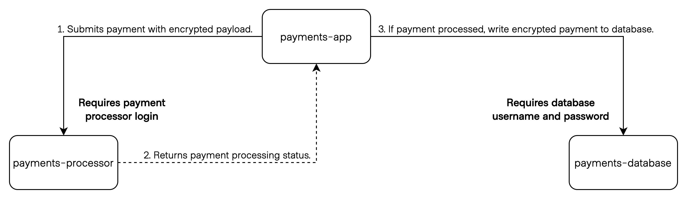

for Development Teams

---

## Introduction

------

### Secrets

Passwords, tokens, certificates,
and other sensitive information
used to access other services.

------

### The Problem

------

How does your application use secrets?

1. Deploy by CI framework.
1. Use environment variables.
1. Encrypt and commit to version control.

------

Imagine the secret is compromised.

------

How does your application get a new secret?

1. Deploy the new secret.
1. Restart the application.

------

### The Solution

------

What if you put all the secrets in a central location?

1. Secure secrets in one place.
1. Audit secret usage and revocation.

------

## Secrets Management

Manage and audit usage of secrets
in a central location.

------

How do your applications get secrets from
secrets management?

1. Call its API.
1. Read secrets from a file or
   environment variables created
   by a separate process.

---

## The NEW Problem

------

How does your application get a new secret
from secrets management?

------

Your application _must_...

- Use the new secret
- Secure all private data

...while maintaining availability.

---

## Objectives

---

### Write an application that...

1. Gets a secret from secrets management.

1. Reloads when a secret changes.

1. Encrypts data in memory using secrets
   management.

---

## Setup

------



------

Demo uses Kubernetes.

------

## Kubernetes

1. Install and start [Minikube](https://minikube.sigs.k8s.io/docs/start/).

1. Install [Vault CLI](https://www.vaultproject.io/docs/install).

1. Clone [hashicorp-dev-advocates/workshop-vault-for-developers](https://github.com/hashicorp-dev-advocates/workshop-vault-for-developers).

------

### Optional

1. Install [Postman](https://www.postman.com/downloads/) for easier API calls.

1. Import the Postman collection from the `postman/` directory.

1. Update the Postman variables to point to your Kubernetes cluster.
   ```shell
   baseUrl=http://$(minikube ip):30081
   vaultUrl=http://$(minikube ip):30820
   processorUrl=http://$(minikube ip):30080
   ```

------

Change to Kubernetes working directory and
set up your environment.

```shell
$ cd kubernetes
$ make setup
```

---

## 1. Get a secret from secrets management.

------

### Two types of secrets

1. _Static_ - you create and store it as a value
1. Dynamic - secrets management rotates it

------

### Vault Secrets Engine

Stores static and dynamic secrets at a specific path.

------

### 1.1. Learn how to use the Vault API

------

#### Authenticate to Vault (with Token)

```shell
$ export VAULT_ADDR=http://localhost:8200
$ export VAULT_TOKEN="some-root-token"
```

------

> Your Vault team will have [Vault authentication methods](https://www.vaultproject.io/docs/auth) set up for you.

------

#### Get a static secret

```shell
$ curl -H "X-Vault-Token:${VAULT_TOKEN}" \
  ${VAULT_ADDR}/v1/payments/secrets/data/processor
```

------

#### Optional: Try it with Postman

------

Username and password logs into the `payment-processor` API.

------

Do you have to refactor your application to depend on Vault?

------

Not necessarily!

------

### 1.2. Learn how to use Vault agent

------

#### Vault Agent
runs as a separate process. It gets a secret in Vault
and writes the secret out to a file that you template.

------

#### Why run another process?

- Avoid adding more code
- Automatically handles retries and secrets refreshes
- Separation of concerns between reading and using secrets

------

Vault agent comes with the Vault binary.

```shell
$ vault agent --help

Usage: vault agent [options]

  This command starts a Vault agent that can perform automatic authentication
  in certain environments.
```

------

#### What is Vault agent doing?

1. Retrieves the payment processor's API username and password.

1. Writes template with secrets to a file.

------

### Kubernetes

- Review Vault agent configuration.
  ```shell
  $ cat applications/payments-app.yaml
  ```

- Injector already running in your cluster.
  ```shell
  $ kubectl get pods
  vault-0                                1/1     Running
  vault-agent-injector-bb5cd485b-glqfj   1/1     Running
  ```

------

Add [annotations](https://developer.hashicorp.com/vault/docs/platform/k8s/injector/annotations).

```yaml
## omitted for clarity
spec:
  template:
    metadata:
      ## omitted for clarity
      annotations:
        vault.hashicorp.com/agent-inject: "true"
        vault.hashicorp.com/role: "payments-app"
        # Use cached secrets and lease from vault-agent initialization to agent
        vault.hashicorp.com/agent-cache-enable: "true"

        ## omitted for clarity

        vault.hashicorp.com/agent-inject-secret-processor: "payments/secrets/data/processor"
        vault.hashicorp.com/secret-volume-path-processor: "/vault/secrets/config/processor"
        vault.hashicorp.com/agent-inject-file-processor: "payments-app.properties"
        vault.hashicorp.com/agent-inject-template-processor: |
          payment.processor.url=http://payments-processor:8080
          {{- with secret "payments/secrets/processor" }}
          payment.processor.username={{ .Data.data.username }}
          payment.processor.password={{ .Data.data.password }}
          {{- end }}
```

------

#### Secrets in different paths

Create an annotation and template _per_ secret path.

```yaml
## omitted for clarity
spec:
  template:
    metadata:
      ## omitted for clarity
      annotations:
        ## omitted for clarity

        # Template for processor secrets
        vault.hashicorp.com/agent-inject-secret-processor: "payments/secrets/data/processor"
        vault.hashicorp.com/secret-volume-path-processor: "/vault-agent/config/processor"
        vault.hashicorp.com/agent-inject-file-processor: "payments-app.properties"

        # Template for database secrets
        vault.hashicorp.com/agent-inject-secret-database: "payments/database/creds/payments-app"
        vault.hashicorp.com/secret-volume-path-database: "/vault-agent/config/database"
        vault.hashicorp.com/agent-inject-file-database: "payments-app.properties"
```

---

## 2. Reload when a secret changes.

------

### Two types of secrets

1. Static - you create and store it as a value
1. _Dynamic_ - secrets management rotates it

------

This example uses dynamic _database_ secrets.

Vault changes the username and password every few minutes.

------

#### What is Vault agent doing?

1. Retrieves the database username and password.
1. Writes template with secrets to a file.
   ```shell
   $ cat /vault/secrets/config/database/payments-app.properties

   payments.db.url=jdbc:postgresql://payments-database:5432/payments
   payments.db.username=v-approle-payments-bS8xAMJgZHt9qIg0n28z-1660319749
   payments.db.password=NtkaNwyBIC6q7IKisA-z
   ```
1. Renders new file with new credentials.

------

> Your Vault team probably set up dynamic secrets in Vault for you.

------

#### What about your application?

1. Secret changes.
1. Vault agent generates new file with new secret.
1. Application using old secret!! 😞

------

### 2.1. Refactor application to reload

------

Depends on your framework!

If _no_ live reload, need code to respond to termination signal (e.g., `SIGTERM`).

------

Choose your adventure.

[Spring Boot - Termination Signal](#/7/9)

[Spring Boot - Live Reload](#/7/10)

------

### Spring Boot - Termination Signal

Enable graceful shutdown in `bootstrap.yml`

```yaml
server:
  shutdown: graceful
```

[Continue →](#/7/11)

------

### Spring Boot - Live Reload

- Set up embedded Spring Cloud Config Server
  ```shell
  $ cat payments-app/java/src/main/resources/bootstrap.yml
  ```

- Enable Spring Boot Actuator `refresh` endpoint
  ```shell
  $ cat payments-app/java/src/main/resources/application.properties
  ```

[Continue →](#/7/11)

------

#### Run the Spring Boot application

```shell
$ make java
```

------

### Test the application

```shell
$ curl $(minikube service payments-app --url)/payments

[
  {
    "id": "2310d6be-0e80-11ed-861d-0242ac120002",
    "name": "Red Panda",
    "createdAt": "2022-08-11T00:00:00.000+00:00",
    "billing_address": "8 Eastern Himalayas Drive"
  }
]
```

------

### 2.2. Configure Vault agent to reload application

------

Define Vault agent's [`exec`](https://developer.hashicorp.com/vault/docs/agent/template#exec)
or [`command`](https://developer.hashicorp.com/vault/docs/agent/template#command)
stanza to run a command that reloads the application.

------

Choose your adventure.

[Kubernetes - Termination Signal](#/7/16)

[Kubernetes - Live Reload](#/7/17)

------

#### Kubernetes - Termination Signal

Add [`vault.hashicorp.com/agent-inject-command`](https://developer.hashicorp.com/vault/docs/platform/k8s/injector/annotations#vault-hashicorp-com-agent-inject-command)
annotation to issue termination signal.

```yaml
## omitted for clarity
spec:
  ## omitted for clarity
  template:
    metadata:
      annotations:
        ## omitted for clarity
        vault.hashicorp.com/agent-run-as-same-user: "true"
        vault.hashicorp.com/agent-inject-command-database: |
          kill -TERM $(pidof java)
    spec:
      ## omitted for clarity
      shareProcessNamespace: true
      containers:
        - name: payments-app
          securityContext:
            runAsUser: 1000
            runAsGroup: 3000
```

[Continue →](#/7/18)

------

#### Kubernetes - Live Reload

Add [`vault.hashicorp.com/agent-inject-command`](https://developer.hashicorp.com/vault/docs/platform/k8s/injector/annotations#vault-hashicorp-com-agent-inject-command)
annotation to reload application properties.

```yaml
## omitted for clarity
spec:
  ## omitted for clarity
  template:
    metadata:
      annotations:
        ## omitted for clarity
        vault.hashicorp.com/agent-inject-command-database: |
          wget -qO- --header='Content-Type:application/json' --post-data='{}' http://127.0.0.1:8081/actuator/refresh
```

[Continue →](#/7/18)

------

#### Vault agent reloads application


```shell
[INFO] (runner) rendered "(dynamic)" => "/vault/secrets/config/database/payments-app.properties"
[INFO] (runner) executing command "[\"kill -TERM $(pidof java)\\n\"]" from "(dynamic)" => "/vault/secrets/config/database/payments-app.properties"
[INFO] (child) spawning: sh -c kill -TERM $(pidof java)
```

------

#### Static Secrets (Key-Value)

Renders every 5 minutes by default.

Change with [`static_secret_render_interval`](https://developer.hashicorp.com/vault/docs/agent/template#static_secret_render_interval).

---

## 3. Encrypt data in memory using secrets management.

------

For encryption / decryption, use a [Vault SDK](https://www.vaultproject.io/api-docs/libraries) to
make API calls from application to Vault.

(You can't use Vault agent.)

------

### 3.1. Install Vault SDK for application

------

Choose your adventure.

[Spring Boot](#/8/4)

------

### Spring Boot

- Add [Spring Cloud Vault](https://cloud.spring.io/spring-cloud-vault/reference/html/) to dependencies.
  ```shell
  $ cat payments-app/java/build.gradle
  ```

- Configure Vault connection for Spring Cloud Vault.
  ```shell
  $ cat payments-app/java/src/main/resources/bootstrap.yml
  ```

------

Override container entrypoint with Vault agent token.

```yaml
apiVersion: apps/v1
kind: Deployment
metadata:
  name: payments-app
spec:
  ## omitted for clarity
  template:
    ## omitted for clarity
    spec:
    ## omitted for clarity
      containers:
        - name: payments-app
          ## omitted for clarity
          command: ["/bin/sh"]
          args: ["-c", "java -XX:+UseContainerSupport -Dspring.cloud.config.server.vault.token=$(cat /vault/secrets/token) -Dspring.cloud.vault.token=$(cat /vault/secrets/token) -Djava.security.egd=file:/dev/./urandom -jar /app/spring-boot-application.jar"]
```

[Continue →](#/8/6)

------

### 3.2. Write code to encrypt/decrypt with Vault keys

------

Choose your adventure.

[Spring Boot](#/8/8)

------

### Spring Boot

```java
// VaultTransit.java

package com.hashicorpdevadvocates.paymentsapp.model;

import org.springframework.beans.factory.annotation.Autowired;
import org.springframework.beans.factory.annotation.Value;
import org.springframework.stereotype.Component;
import org.springframework.vault.core.VaultOperations;

@Component
public class VaultTransit {
    @Autowired
    VaultOperations vault;

    @Value("${payment.transit.path:transit}")
    private String path;

    @Value("${payment.transit.key:payments-app}")
    private String key;

    public String decrypt(String billingAddress) {
        return vault.opsForTransit(path).decrypt(key, billingAddress);
    }

    public String encrypt(String billingAddress) {
        return vault.opsForTransit(path)
                .encrypt(key, billingAddress);
    }
}
```

------

Encrypt billing address for processor and database.

```java
// PaymentService.java

// omitted for clarity
ResponseEntity<Payment> paid = paymentProcessor.submitPayment(
   payment.getName(),
   vault.encrypt(payment.getBillingAddress()));
```

------

Decrypt billing address for payments when reading
from database.

```java
// VaultTransitConverter.java

public class VaultTransitConverter implements AttributeConverter<String, String> {
   // omitted for clarity

    @Override
    public String convertToEntityAttribute(
      String billingAddress) {
        if (billingAddress.startsWith("vault:")) {
            return vault.decrypt(billingAddress);
        }
        return billingAddress;
    }
}
```

[Continue →](#/8/11)

------

### Test the application

```shell
$ curl -XPOST \
  $(minikube service payments-app --url)/payments \
  -d '{"name":"Pangolin","billing_address":"4 Cape Street"}' \
  -H "Content-Type:application/json"

{
  "id": "SOME_PAYMENT_ID",
  "name": "Pangolin",
  "createdAt": "2022-08-11T19:53:58.275+00:00",
  "status": "success, payment information transmitted securely",
  "billing_address": "vault:v1:hycmv1gWMVQ3i/z3IE9iE5GnBjh93ziA5QIltGHL2TaHmmW/0C/7hZA="
}
```

------

### Test the application

```shell
$ curl $(minikube service payments-app --url)/payments/SOME_PAYMENT_ID

{
  "id": "09f09919-6c0b-4bd3-ba4a-2b57f63c8de2",
  "name": "Pangolin",
  "createdAt": "2022-08-11T19:53:58.275+00:00",
  "billing_address": "4 Cape Street"
}
```

---

## Recap

------

1. Gets a secret from secrets management.
   1. Learn how to use the Vault API
   1. Learn how to use Vault Agent

1. Reloads when a secret changes.
   1. Refactor application to reload
   1. Configure Vault agent to reload application


1. Encrypts data in memory using secrets
   management.
   1. Install Vault SDK for application
   1. Write code to encrypt/decrypt with Vault keys

------

### References

- [Vault](https://developer.hashicorp.com/vault)
  - [Auth Methods](https://developer.hashicorp.com/vault/docs/auth)
  - [Secrets Engines](https://developer.hashicorp.com/vault/docs/secrets)
  - [Vault Agent](https://developer.hashicorp.com/vault/docs/agent)
  - [Kubernetes Annotations](https://developer.hashicorp.com/vault/docs/platform/k8s/injector/annotations)
- [Spring Cloud Vault](https://cloud.spring.io/spring-cloud-vault/reference/html/)